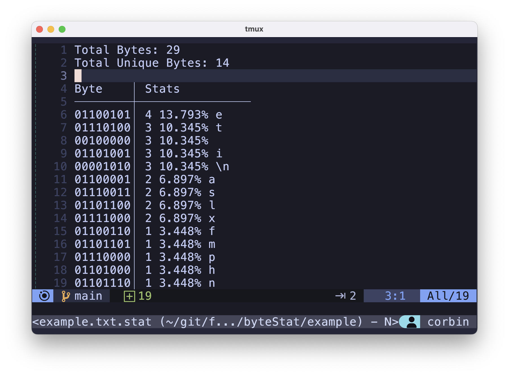

# byteStat
A CLI tool for aggregating statistics on unique bytes in a file (count, percentage, and it's ASCII character)

## Installation
You can simply run the following to install byteStat
```bash
go install github.com/foulscar/byteStat
```

## Usage
```
Usage: byteStat [OPTIONS] <INPUTFILE>

Options:
  help        Show this help message and exit

Examples:
  byteStat help
  byteStat file.txt
  byteStat file.txt > file.txt.stat
```

## Example


